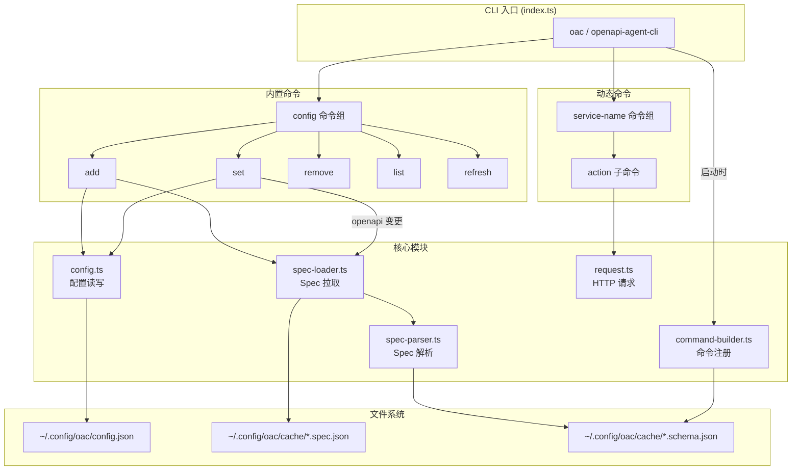

# OAC CLI — 设计

> **状态**: 已批准
> **需求**: [requirements.md](./requirements.md)
> **最后更新**: 2026-03-27

## 概述

六个核心模块各司其职，数据流清晰：config 管理持久化配置 → spec-loader 拉取原始 spec → spec-parser 转换为 schema.json → command-builder 注册命令 → request 执行 HTTP 请求。

## 架构总览



## 模块设计

### 1. config.ts — 配置管理

**职责**：读写 `~/.config/openapi-agent-cli/config.json`

**接口**：

```typescript
interface ServiceConfig {
  url: string;
  openapi: string;
  headers?: Record<string, string>;
}

interface AppConfig {
  services: Record<string, ServiceConfig>;
}

function loadConfig(): AppConfig;
function saveConfig(config: AppConfig): void;
function getService(name: string): ServiceConfig | undefined;
function addService(name: string, config: ServiceConfig): void;
function updateService(name: string, partial: Partial<ServiceConfig>): void;
function removeService(name: string): void;
```

**关键行为**：

- `loadConfig` 文件不存在返回 `{ services: {} }`
- `addService` 检查重名，已存在则抛错
- `updateService` 做 partial merge（`{ ...existing, ...partial }`）
- 本地 spec 相对路径在 `addService` / `updateService` 中转为绝对路径

### 2. spec-loader.ts — Spec 拉取

**职责**：从远程 URL 或本地文件获取原始 OpenAPI spec

**接口**：

```typescript
function fetchSpec(
  serviceName: string,
  serviceConfig: ServiceConfig,
  forceRefresh?: boolean,
): Promise<OpenAPIDocument>;
```

**关键行为**：

- 远程 URL 判定：`openapi.startsWith("http://") || openapi.startsWith("https://")`
- 本地文件走 `SwaggerParser.dereference(resolve(openapi))`
- 远程 URL 缓存结构：`{ fetchedAt: number, spec: object }`，TTL 1 小时
- 缓存路径：`~/.config/openapi-agent-cli/cache/<name>.spec.json`
- `forceRefresh = true` 跳过缓存检查
- 拉取远程 spec 时附带 `serviceConfig.headers`

### 3. spec-parser.ts — Spec 解析

**职责**：将解析后的 OpenAPI spec 转换为扁平 schema.json

**接口**：

```typescript
interface CommandSchema {
  name: string;
  description: string;
  method: string;
  path: string;
  contentType: string;
  binaryFields: string[];
}

interface ServiceSchema {
  generatedAt: number;
  commands: CommandSchema[];
}

function parseAndSave(serviceName: string, spec: OpenAPIDocument): ServiceSchema;
function loadSchema(serviceName: string): ServiceSchema | null;
```

**命令名生成规则**：

1. method 小写前缀：`post-`
2. 去前导 `/`
3. 路径参数去花括号：`{fileId}` → `fileId`
4. 各段 camelCase → kebab-case：`getMonthList` → `get-month-list`
5. 用 `-` 拼接

**辅助函数**：

- `pathToCommandName(path)` — 路径转命令名
- `camelToKebab(str)` — 驼峰转中划线
- `getContentType(operation)` — 检测 multipart 否则 json
- `extractBinaryFields(operation)` — 提取 format:binary 字段名
- `isOperation(value)` — 排除 parameters/summary 等非 operation 键

### 4. command-builder.ts — 动态命令注册

**职责**：读 schema.json 为 commander 子命令注册选项和 action

**接口**：

```typescript
function safeJsonParse(value: string | undefined, flag: string): Record<string, unknown> | undefined;
function buildCommands(group: Command, schema: ServiceSchema, serviceConfig: ServiceConfig): void;
```

**每个子命令选项**：`--body`、`--query`、`--params`、`--header`、`--output`、`--timeout`

**action 内部流程**：

1. `safeJsonParse` 解析各 JSON 参数（失败报友好错误）
2. `--params` 替换路径 `{placeholder}`（缺失抛错）
3. 根据 contentType 选择 `apiUpload` 或 `apiRequest`
4. JSON 响应 `console.log`，binary 响应由 request 内部处理

### 5. request.ts — HTTP 请求

**职责**：发送 HTTP 请求并处理响应

**接口**：

```typescript
function apiRequest(
  config: ServiceConfig,
  method: string,
  path: string,
  body?: Record<string, unknown>,
  query?: Record<string, unknown>,
  customHeaders?: Record<string, string>,
  timeout?: number,
  output?: string,
): Promise<unknown | null>;

function apiUpload(
  config: ServiceConfig,
  path: string,
  body: Record<string, unknown>,
  binaryFields: Set<string>,
  query?: Record<string, unknown>,
  customHeaders?: Record<string, string>,
  timeout?: number,
): Promise<unknown>;
```

**`apiRequest` 响应处理**：

1. `Content-Type: application/json` → `res.json()` 返回
2. `Content-Type: text/*` → `res.text()` 打印，返回 null
3. 其他 → 保存到 `output` 或从 `Content-Disposition` 取名，返回 null

**`apiUpload` 关键行为**：

- binaryFields 中的字段值视为文件路径 → `readFile` + `Blob` + `formData.append`
- 其他字段作为普通表单值
- 不设 `Content-Type`（让 fetch 自动生成 boundary）

**错误处理**：非 2xx → `✗ [status] body` 到 stderr + `process.exit(1)`

### 6. index.ts — 入口

**职责**：commander 初始化 + config 子命令注册 + 动态服务命令注册

**启动流程**：

1. 创建 `program`（name: `oac`）
2. `registerConfigCommands(program)` — 注册 config add/set/remove/list/refresh
3. `loadConfig()` → 遍历 services → `loadSchema()` → `buildCommands()`
4. schema 缺失的服务注册占位 action（提示 refresh）
5. `program.parse()`

## 文件系统结构

```
~/.config/openapi-agent-cli/
├── config.json                    # 服务配置
└── cache/
    ├── <service>.spec.json        # 原始 spec 缓存（仅远程 URL）
    └── <service>.schema.json      # 解析后的命令定义
```

## 错误处理策略

| 场景               | 错误信息                                                 | 退出码 |
| ------------------ | -------------------------------------------------------- | ------ |
| JSON 参数解析失败  | `✗ Invalid JSON in --body: Unexpected token...`          | 1      |
| HTTP 错误响应      | `✗ [404] Not Found`                                      | 1      |
| 服务未配置         | `✗ Service "xxx" not configured. Run: oac config add...` | 1      |
| Schema 缺失        | `✗ Schema not found. Run: oac config refresh xxx`        | 1      |
| 路径参数缺失       | `✗ Missing path param: id`                               | 1      |
| 重复添加服务       | `✗ Service "xxx" already exists. Use: oac config set...` | 1      |
| 远程 spec 拉取失败 | `✗ Failed to fetch spec from <url>: <status>`            | 1      |
| 命令名冲突         | `✗ Command name collision: "xxx" (path: /api/...)`       | 1      |
